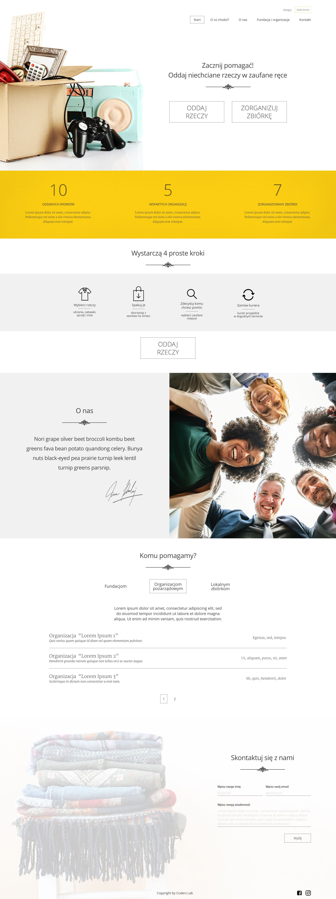

# Oddam w dobre ręce v1.0.0

Strona internetowa napisana w ReactJs dzięki której można przekazać rzeczy fundacjom wspierającym osoby biedne.

## Demo strony: https://oddajrzeczy.netlify.app

## Zdjęcia strony:

This project was bootstrapped with [Create React App](https://github.com/facebook/create-react-app).